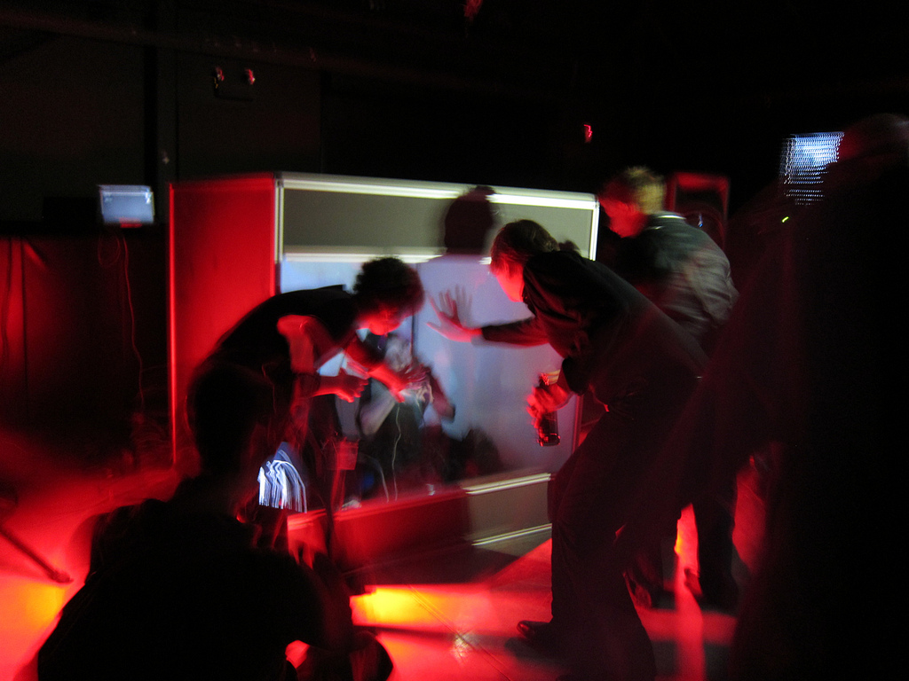
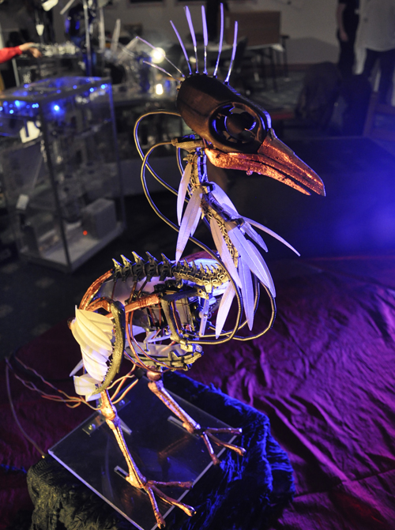
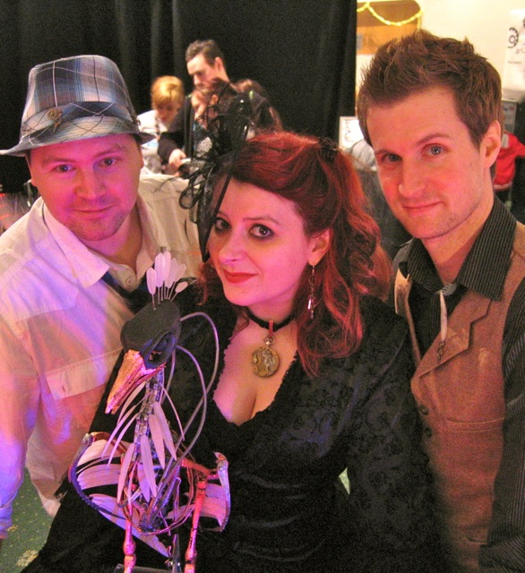
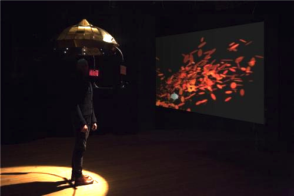
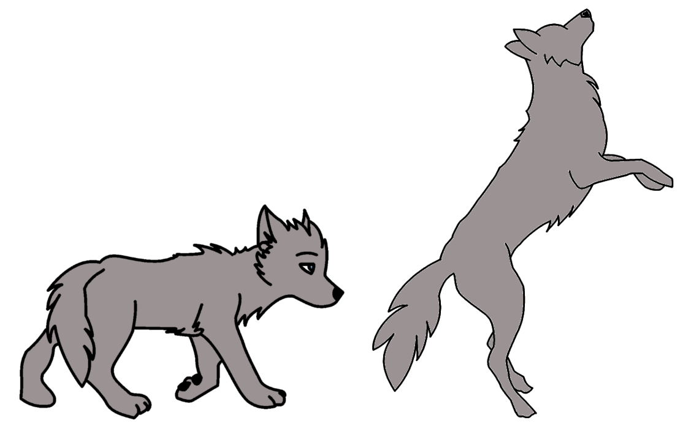
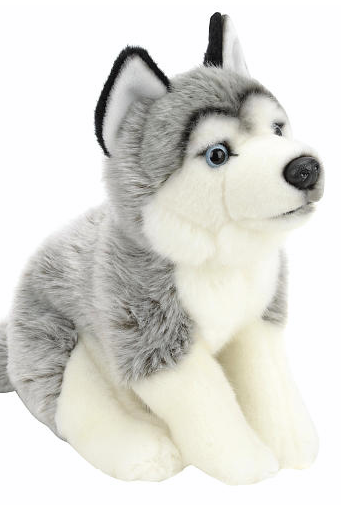

##Creative Play in Public Spaces
###Shearer - QUT talk - Sept 2014

##Links

- http://shearer12345.github.io/talkQUT2014_Sept/
- source: https://github.com/shearer12345/talkQUT2014_Sept

##Structure

- *humanaquarium*
- nightingallery
- eyeResonator
- affectiveTouchGame

##*humanaquarium*

- exploring how interactive technologies can mediate participants' encounters and collaborations with live musicians
- developed & refined over a year's worth of public performances (2009-2011) at 12 different international venues

###*humanaquarium* in action

<video controls data-autoplay src="assets/humanaquariumAtMakerFaireUK2010-AlE-bGH3_q0.mp4" height=600 ></video>

##Designing From Within

- An experience-based approach to designing collaborative interactive performance
- explored public interaction with digital technology through the practice-based inquiry of an inter-disciplinary team of interaction designers and musicians
- literally situating the designers within the performance/use space
- assuming the roles both of performers and of designers
- co-experiencing the works - leaps in understanding occur in the course of discussion, co-experiencing the works with visitors and other staff
- [http://humanaquarium.org/CHI2011_humanaquariumfinalv2.pdf](http://humanaquarium.org/CHI2011_humanaquariumfinalv2.pdf)

###Insights

- A tension emerged between:
  - our instincts and desires as musicians to make more complex and (to us) more satisfying musical pieces
  - and the necessity to retain a simplicity and transparency in our compositions
    - to allow passing viewers to instantly collaborate with us
- we observed numerous peripheral interactions between participants that took place during the performance
- many interesting social encounters were going on at the sidelines of the participants’ primary engagement with the interactive performance
  - despite the fact that the performer-focused format of these works did not actively encourage or facilitate these kinds of interaction

##Nightingallery

- an interactive musical installation featuring an animatronic bird that talks and sings, engaging members of the public in playful dialogue

###Nightgallery in Action

<video controls data-autoplay src="assets/nightingalleryPromo-7Td8chaBxtM.mp4" height=600 ></video>

[Nightingallery Build](http://guyschofield.wordpress.com/2011/04/03/nightingallery-build/)

###Research practice

- part of a research practice that explores social behaviour in public performance spaces through the enactment and examination of interactive, performance-based artworks
- performances
  - BBC Free-thinking (concert and lecture series)
  - Bestival
  - MakerFaire
  - Jam46 (Culture Lab works-in-progress show)
  - Dorkbot at the International Centre For Life
  - British HCI conference

###Starting point - aims

- remove the performer-centric focus we observed in previous works
- observe how participants collaborated and shared their experience amongst one another
- facilitate participants in creatively exploring improvisational possibilities
  - encouraging them to publically perform
- stepping back from the forefront of the installation, we cast ourselves in the role of carnival barkers and fantastical zookeepers

###Our roles as performers

- shifted to a strictly supporting capacity
  - what Benford and Giannachi term *orchestrators of the experience*
  - primary role was to facilitate participants' trajectories
    – i.e. the paths of discovery and exploration they followed as they encountered and experienced the work

###Observations

- how we observed participants shaping what Reeves terms *the spectator experience* of their public interactions with Nightingallery

- Paper in Personal and Ubiquitous Computing

####Sharing private experiences with others

- how participants chose to share (or conceal) their private individual experience with friends, family, or peers

- On one occasion a child repeatedly insisted to her parents that when she asked the bird specific questions (like favourite colour, or name)
- the bird responded with content that we, as the programmers, knew was not contained in the bird’s phrase bank
- She made up a very detailed description of the conversation she insisted that she had had (which we did not choose to contradict!)

- configuring the installation to use the asymmetric telephone interface allowed us
- an easy way to examine how people learned the interaction scheme and then pass on this learning to their peers through the aforementioned variety of direct and indirect means

####Performing and Music-Making

- how participants were able to use the Nightingallery installation to explicitly perform and engage in music-making activities

- Participants rapidly discovered that even speaking or singing quietly would still cause the bird to respond with an audible musical birdsong corresponding to what they had said or sung
- Shy participants could thereby allow the bird to do the performing rather than risk being heard singing themselves, often cupping their hands over the microphone so that their own vocal contributions were inaudible to others sharing the space.

##EyeResonator

- interactive art ecosystem that engages viewers by responding to their eye movements
- detects behavioural changes of the person and subsequently coaxes viewers' self-observation.
> about the meditative experience ... the technology is simply a tool for creating this

###EyeResonator in Action

<video controls data-autoplay src="assets/eyeResonatorTrailer257503275.mp4" height=600 ></video>

- CHI2015 paper on evaluation

##Affective Touch Games

###Affective Touch

- the connections/identifications/empathies with the character(s) is a key aspect of the computer games and other media
- affective touch has an important role in facilitating trust and attachment to other humans, and also animals, and even inanimate stuffed toys.

###Research Question

- how does touching/stroking a physical replica of an in-game character support players' attachment with that in-game character and the impact on their overall game experience.

